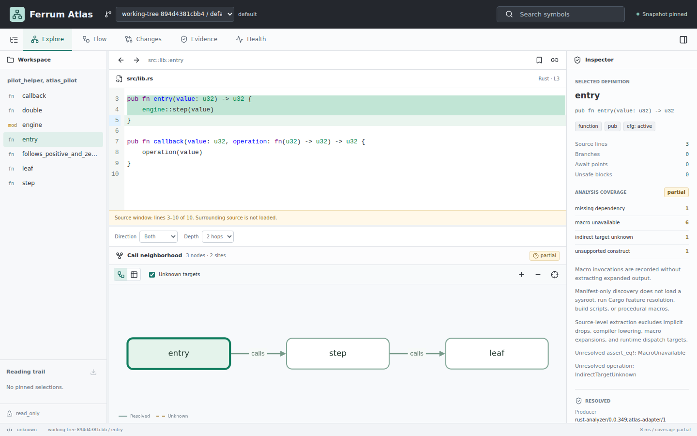

# Ferrum Atlas

Source-linked Rust code maps, durable snapshots, and evidence-aware change review.

Ferrum Atlas captures Rust source without running the workspace, resolves supported local calls with rust-analyzer, and publishes durable, source-linked snapshots. The browser combines exact source, bounded call graphs, source-flow points, change review, and separately imported run evidence.

This is a working local implementation of the included [design specification](rust_analyzer_and_visualizer.md), not completion of its entire multi-week roadmap. A pinned compiler MIR adapter, warm watch sessions, retention, portable snapshots, selected graph analysis and durable local jobs are implemented. Hosted distribution, hostile executable isolation, fine-grained persistent delta shards and release-scale qualification remain open.



The [local implementation report](docs/milestones/local-slice.md) records passing CI, test coverage, reviewed fixes, screenshots, and the remaining acceptance gates.

## Run Locally

Linux, Rust (pinned by `rust-toolchain.toml`), and Node.js 22.22.1 are required.

```sh
cargo build --locked -p ferrum-atlas
npm --prefix web ci
npm --prefix web run build
target/debug/atlas init --workspace fixtures/rust/pilot --trust read-only
target/debug/atlas index --level semantic
target/debug/atlas serve
```

Open the authenticated URL printed by `serve`. To analyze your project, replace the fixture path and use a separate `--store PATH`. The viewer and API bind only to loopback; the GitHub repository hosts the project source, not your captured code.

## Included

- Frozen UTF-8 source with byte-exact Unicode/CRLF spans and content hashes.
- Explicit target, features, cfg and local dependency contexts; inactive and unknown configurations stay distinct.
- Syntax fallback, semantic direct calls, unknown indirect targets, and source-flow points.
- Immutable SQLite shards, atomic catalog publication, integrity checks and restart recovery.
- Pin-aware retention with reviewed deletion plans and validated portable snapshot directories.
- Warm semantic worker sessions, durable bounded job scheduling, cancellation and progress replay.
- Authenticated, context-pinned search, callers/callees, source, flow, evidence and structural diffs.
- Selected SCCs, cycles, path exploration, fan metrics and correlation-anchor trace comparisons.
- Source/graph navigation, table alternatives, review views and shareable pinned links.
- Artifact-matched test outcomes and independent-clock trace streams, imported without execution.
- Optional exact-toolchain MIR records, checked against captured source before display.

No Cargo commands, build scripts, rustc wrappers or procedural macros from an analyzed workspace run in read-only mode. Missing dependencies, generated inputs, macro expansions and unsupported semantics reduce coverage explicitly. Unknown targets are not guessed, and bounded results do not imply complete absence.

## Verify

```sh
cargo fmt --all --check
cargo clippy --locked --workspace --all-targets -- -D warnings
cargo test --locked --workspace
cargo run --locked -p xtask -- check-types
npm --prefix web run build
cd web
npx playwright install chromium
npm test
```

Tests cover extraction, configuration, offsets, authorization, query limits, actual publication crashes, worker cancellation, evidence imports, restart workflows and browser interactions. Performance smoke reports are not scale certification.

## Development

The workspace separates model, capture, rust-analyzer adapter, storage, queries, analysis, scheduler, imported evidence, HTTP and CLI ownership. TypeScript contracts are generated from Rust. See [local operations](docs/operations/local.md), [compiler and job workflows](docs/operations/compiler-and-jobs.md), [API contracts](docs/schema/api.md), [architecture decisions](docs/adr/0001-local-architecture.md), and [the tracked roadmap](https://github.com/harsh-nod/ferrum-atlas/issues).

Project code is MIT OR Apache-2.0. Third-party components retain their own licenses; see [dependency notes](docs/dependencies.md).
