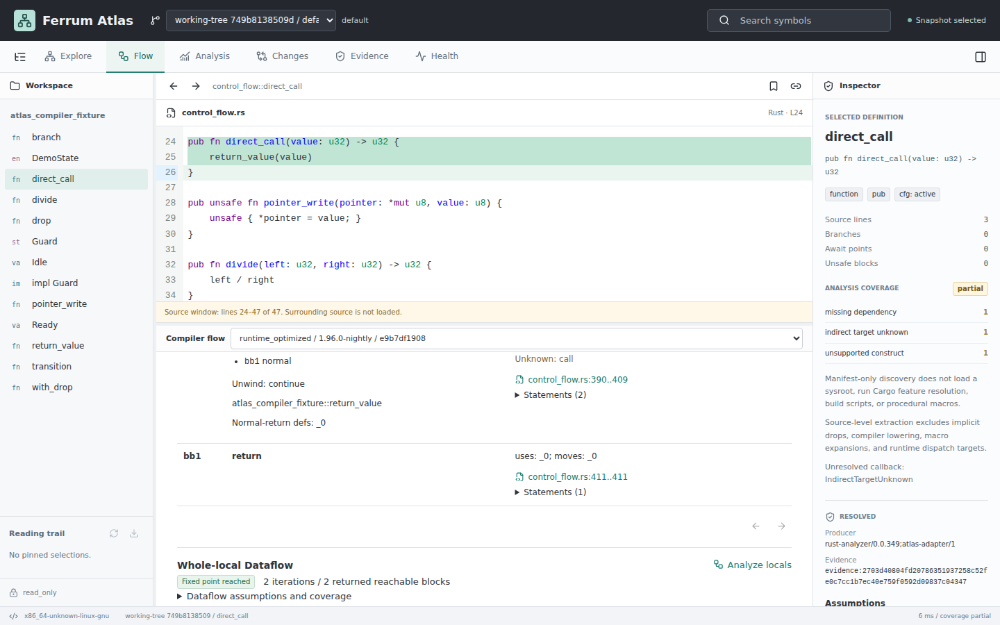
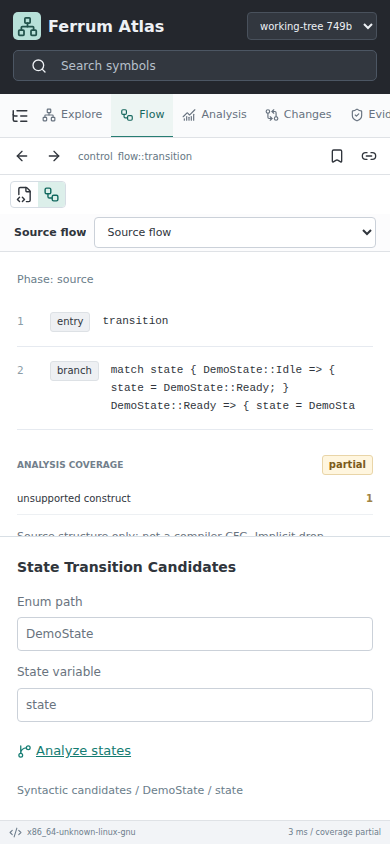

# Local Package Verification

On 2026-09-15, [workflow 34952777116](https://github.com/harsh-nod/ferrum-atlas/actions/runs/34952777116)
built the Linux x86_64 `0.1.0-preview.1` candidate from source commit
`e0bf7a13e582cef735cdabec5d3e609747e19131`. The workflow succeeded. No tag,
GitHub release or draft was created; the downloadable Actions artifact is a
time-limited review candidate, not a qualified release.

Archive: `ferrum-atlas-0.1.0-preview.1-x86_64-unknown-linux-gnu.tar.gz`

SHA-256: `91150eb8dffa8b8c9f4c7859728881447111977c11da1848903f7e59fde46338`

Local verification of the downloaded artifact, not the development binary:

- Streaming archive validation passed for 500 payload files, followed by the
  independent `sha256sum --check` sidecar check.
- Extracted only after validation into a fresh, ignored installation directory.
- Packaged `atlas --version` returned `atlas 0.1.0`; the candidate suffix is in
  `RELEASE.json`, while the binary reports the Cargo base version.
- Packaged `doctor` verified both captured demonstration snapshots with no errors.
- The packaged CLI served the packaged browser on loopback. Playwright selected
  the captured function, rendered its graph, opened exact compiler MIR and ran
  reaching definitions to a fixed point. The canvas check counted 42,532
  nonblank pixels and the browser reported zero page errors.
- Stopped the temporary package-test server after verification. The separate
  development demo is not an installed release.

The demonstration uses public test-fixture source, exact compiler imports and
two snapshots. It establishes that this package runs these local workflows, not
scale, complete Rust semantics, operating-system isolation, accessibility
certification or results from human participants. Later commits are not covered
by this exact archive hash.

The [installation guide](../operations/install.md) records runtime requirements
and remaining distribution review gates. Archive checksums and package shape
validation do not establish authenticity or complete license compliance.

## Inspected Viewer States

These images were captured separately from the actual integrated local app,
using the same nonprivate fixture and imported compiler evidence:

The automated mobile state-review regression additionally exercises the result
table, acceptance/rejection controls and source navigation; the image is only a
visible selection checkpoint, not a substitute for that test.
